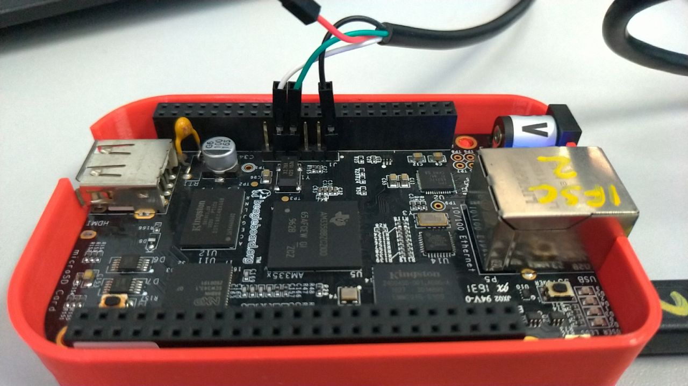

# Lab 01

O objetivo deste laboratório é prepararmos o seu computador para a realização das práticas que realizaremos ao longo do curso.

Recomendamos o uso de uma distribuição atual de Linux para o desenvolvimento das atividades práticas, o que pode ser realizado através de uma instalação nativa em seu computador, ou através do uso de um sistema de virtualização como VirtualBox ou VMWare. Também é possível utilizar o Windows Subsystem for Linux (WSL). Algumas instruções para configuração do WSL no Windows são fornecidas nesta [página](wsl/README.md).

## Passos Iniciais

Inicialmente, vamos garantir que o nosso sistema Ubuntu esteja atualizado, executando os seguintes comandos:

```
sudo apt update
sudo apt dist-upgrade
```

Adicionalmente, recomendamos a instalação das seguintes ferramentas adicionais:

```
sudo apt install git vim nano 
```

Instalar as seguintes dependências para uso do Buildroot

```
sudo apt install sed make binutils gcc g++ bash patch gzip bzip2 perl tar cpio python unzip rsync wget libncurses-dev
```

Clonar o repositório com o comando

```
git clone --recurse-submodules https://github.com/profmarcondes/emb22109.git
```

O último comando irá fazer o clone deste repositório, que contém além destes laboratórios, outras pastas que serão utilizadas em laboratórios futuros, além do próprio repositório do Buildroot já configurado para a versão que iremos utilizar durante o curso.

Agora entraremos na pasta buildroot, dentro do repositório para iniciar a configuração do mesmo. Utilize o comando abaixo para isto:

```
cd emb22109/buildroot
```

## Configurando o Buildroot

Se você olhar no diretório configs/, verá que existe um arquivo chamado beaglebone_defconfig, que é um arquivo de configuração Buildroot pronto para uso para construir um sistema para a plataforma BeagleBone Black. No entanto, como queremos aprender sobre o Buildroot, iniciaremos nossa própria configuração do princípio!

Inicie o utilitário de configuração Buildroot:

```
make menuconfig
```

Realize as seguintes configurações na ferramenta:

#### Target Options

Neste menu iremos configurar a arquitetura alvo de nosso sistema embarcado. A plataforma Beagle Bone Black é baseada na arquitetura ARM, e de acordo com a documentação disponível em https://beagleboard.org/BLACK, a mesma utiliza o SoC da Texas Instruments AM335x, que é baseado em um ARM Cortex-A8. Desta forma, realize as seguintes configurações:

  - Selecione ARM (little endian) como  target architecture
  - Selecione cortex-A8 como Target Architecture Variant

#### Build options

Por hora não necessitamos modificar nenhum configuração do menu Build Options. De qualquer forma, aproveita para visitar esse menu e observar as opções de configuração que temos disponível. A ferramenta KConfig possui uma opção de ajuda para descrever mais informações sobre cada item de configuração. 

#### Toolchain
  - Configure External toolchain como Toolchain type
  - Selecione Arm ARM 2021.07 como Toolchain
 
#### System
 - Configure a senha de root (Root password). Utilize a senha padrão tmp1223
 
#### Linux Kernel
 - Habilitar a opção de Linux Kernel 
 - Kernel version -> selecionar "Custom version" e configurar a versão 5.15.35
 - Configurar Defconfig name com "omap2plus"
 - Kernel binary format, utilizar zImage
 - Habilite a opção "Build a Device Tree Blob (DTB)" 
 - Configurar In-tree Device Tree Source file names com "am335x-boneblack"
 - Habilitar opção "Needs host OpenSSL"
 
#### Target Packages

Por hora não iremos habilitar nenhum outro pacote nesta configuração inicial

#### Filesystem

Por hora não iremos modificar a opção padrão (tar the root filesystem)

#### Bootloaders

  - Habilitar o U-boot
  - Confirmar o BUild system como Kconfig
  - U-Boot version -> selecionar "Custom version" e configurar a versão 2022.04
  - Configurar Board defconfig como am335x_evm
  - Marcar U-Boot needs OpenSSL
  - No menu U-Boot binary format
    - Desmarcar "u-boot.bin"
    - Marcar "u-boot.img"
  - Habilitar Install U-Boot SPL binary image 
  - Configurar U-Boot SPL binary image name com "MLO"
  - Configurar Custom make options com "DEVICE_TREE=am335x-boneblack"

#### Finalizando a configuração e gerando o Linux Embarcado

Pronto, agora sai de todos os menus da ferramenta Kconfig, não se esquecendo de confirmar a gravação das configurações no sistema, respondeno Yes quando perguntado.

Você irá voltar a linha de comando, dentro da pasta do Buildroot. Para iniciar a geração do sistema, basta executar o comando ```make```, mas iremos modificar um pouco o comando para criar também um arquivo de log de toda a geração do sistema, desta forma, execute o comando:

```
make 2>&1 | tee build.log
```

Pronto ! Agora esse processo deve demorar um pouquinho devido a necessidade de baixar todos os pacotes dos componentes necessários, além da compilação do kernel também ser um pouco demorada.

## Preparando a Beagle Bone (em tradução)

The BeagleBone Black is powered via the USB-A to mini-USB cable, connected to the mini-USB
connector labeled P4 on the back of the board.

The Beaglebone serial connector is exported on the 6 male pins close to one of the 48 pins
headers. Using your special USB to Serial adapter provided by your instructor, connect the
ground wire (black) to the pin closest to the power supply connector (let’s call it pin 1), and
the TX (green) and RX (white) wires to the pins 4 (board RX) and 5 (board TX). You always should 
make sure that you connect the TX pin of the cable to the RX pin of the board, and vice-versa, 
whatever the board and cables that you use.

<p align="center">

Once the USB to Serial connector is plugged in, a new serial port should appear: /dev/ttyUSB0.

You can also see this device appear by looking at the output of dmesg.

To communicate with the board through the serial port, install a serial communication program,
such as picocom:

```
sudo apt install picocom
```

If you run ls -l /dev/ttyUSB0, you can also see that only root and users belonging to the
dialout group have read and write access to this file. Therefore, you need to add your user to
the dialout group:

```
sudo adduser $USER dialout
```

Important: for the group change to be effective, in Ubuntu 18.04, you have to completely reboot
the system <!--2 As explained on https://askubuntu.com/questions/1045993/after-adding-a-group-logoutlogin-is-notenough-in-18-04/.
-->. A workaround is to run newgrp dialout, but it is not global. You have to run it
in each terminal.

Now, you can run picocom -b 115200 /dev/ttyUSB0, to start serial communication on /dev/
ttyUSB0, with a baudrate of 115200. If you wish to exit picocom, press [Ctrl][a] followed by
[Ctrl][x].

There should be nothing on the serial line so far, as the board is not powered up yet.

## Prepare the SD card

Our SD card needs to be split in two partitions:

  - A first partition for the bootloader. It needs to comply with the requirements of the
AM335x SoC so that it can find the bootloader in this partition. It should be a FAT32 partition. 
We will store the bootloader (MLO and u-boot.img), the kernel image (zImage)and
the Device Tree (am335x-boneblack.dtb). 
  - A second partition for the root filesystem. It can use whichever filesystem type you want,
but for our system, we’ll use ext4.

First, let’s identify under what name your SD card is identified in your system: look at the
output of cat /proc/partitions and find your SD card. In general, if you use the internal SD
card reader of a laptop, it will be mmcblk0, while if you use an external USB SD card reader, it
will be sdX (i.e sdb, sdc, etc.). **Be careful: /dev/sda is generally the hard drive of your
machine!**

If your SD card is /dev/mmcblk0, then the partitions inside the SD card are named /dev/
mmcblk0p1, /dev/mmcblk0p2, etc. If your SD card is /dev/sdc, then the partitions inside are
named /dev/sdc1, /dev/sdc2, etc.

To format your SD card, do the following steps:

1. Unmount all partitions of your SD card (they are generally automatically mounted by
Ubuntu)

2. Erase the beginning of the SD card to ensure that the existing partitions are not going to
be mistakenly detected:

   ```
   sudo dd if=/dev/zero of=/dev/mmcblk0 bs=1M count=16. 
   ```
   
   Use sdc or sdb instead of mmcblk0 if needed.

3. Create the two partitions.
    - Start the cfdisk tool for that:
    
      ```
      sudo cfdisk /dev/mmcblk0      
      ```
    
    - Chose the dos partition table type
    - Create a first small partition (128 MB), primary, with type e (W95 FAT16) and mark it bootable
    - Create a second partition, also primary, with the rest of the available space, with type 83 (Linux).
    - Exit cfdisk


4. Format the first partition as a FAT32 filesystem:

   ```
   sudo mkfs.vfat -F 32 -n boot /dev/mmcblk0p1. 
   ```

   Use sdc1 or sdb1 instead of mmcblk0p1 if needed.
  
5. Format the second partition as an ext4 filesystem:

   ```
   sudo mkfs.ext4 -L rootfs -E nodiscard /dev/mmcblk0p2. 
   ```
   
   Use sdc2 or sdb2 instead of mmcblk0p2 if needed.
  
      - -L assigns a volume name to the partition
      - -E nodiscard disables bad block discarding. While this should be a useful option for cards with bad blocks, skipping this step saves long minutes in SD cards.

Remove the SD card and insert it again, the two partitions should be mounted automatically,
in /media/$USER/boot and /media/$USER/rootfs.

Now everything should be ready. Hopefully by that time the Buildroot build should have
completed. If not, wait a little bit more.

## Flash the system

Once Buildroot has finished building the system, it’s time to put it on the SD card:

  - Copy the MLO, u-boot.img, zImage and am335x-boneblack.dtb files from output/images/
to the boot partition of the SD card.
  - Extract the rootfs.tar file to the rootfs partition of the SD card, using:
sudo tar -C /media/$USER/rootfs/ -xf output/images/rootfs.tar .
  - Create a file named extlinux/extlinux.conf in the boot partition. This file should contain
the following lines:

```
label buildroot
kernel /zImage
devicetree /am335x-boneblack.dtb
append console=ttyO0,115200 root=/dev/mmcblk0p2 rootwait
```

These lines teach the U-Boot bootloader how to load the Linux kernel image and the
Device Tree, before booting the kernel. It uses a standard U-Boot mechanism called distro
boot command, see https://source.denx.de/u-boot/u-boot/-/raw/master/doc/README.
distro for more details.

Cleanly unmount the two SD card partitions, and eject the SD card.

## Boot the system

Insert the SD card in the BeagleBone Black. Push the S2 button (located near the USB host
connector) and plug the USB power cable while holding S2. Pushing S2 forces the BeagleBone
Black to boot from the SD card instead of from the internal eMMC.

You should see your system booting. Make sure that the U-Boot SPL and U-Boot version and
build dates match with the current date. Do the same check for the Linux kernel.
Login as root on the BeagleBone Black, and explore the system. Run ps to see which processes
are running, and look at what Buildroot has generated in /bin, /lib, /usr and /etc.
Note: if your system doesn’t boot as expected, make sure to reset the U-Boot environment by
running the following U-Boot commands:

```
env default -f -a
saveenv
```

and reset. This is needed because the U-Boot loaded from the SD card still loads the U-Boot
environment from the eMMC. Ask your instructor for additional clarifications if needed.

## Explore the build log

Back to your build machine, since we redirected the build output to a file called build.log, we
can now have a look at it to see what happened. Since the Buildroot build is quite verbose,
Buildroot prints before each important step a message prefixed by the >>> sign. So to get an
overall idea of what the build did, you can run:

```
grep ">>>" build.log
```

You see the different packages between downloaded, extracted, patched, configured, built and
installed.

Feel free to explore the output/ directory as well.
