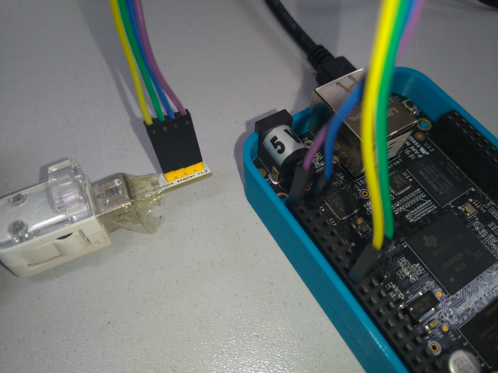

# Lab 02

Objectives:
  - Explore the build output
  - Customize the root filesystem using a rootfs overlay
  - Customize the Linux kernel configuration
  - Use a post-build script
  - Customize the kernel with patches and
  - Add more packages
  - Use defconfig files and out of tree build

## Explore the build output

Now that we have discussed during the lectures the organization of the Buildroot output tree, take some time to look inside output/ for the different build artefacts. And especially:

  - Identify where the cross-compiler has been installed.
  - Identify where the source code for the different components has been extracted, and  which packages have been built.
  - Identify where the target root filesystem has been created, and read the `THIS_IS_NOT_YOUR_ROOT_FILESYSTEM` file.
  - See where the staging symbolic link is pointing to.

## Use a rootfs overlay to setup the network

We will use Ethernet over USB to provide network connectivity between our embedded system and the development PC. To achieve this we will need to:

1. Add an init script to setup network over USB
2. Add a configuration file that configures the network interface with the appropriate IP
address
3. Instal DHCP Server to provide automatic configuration of network on development PC.

### Init script for USB network setup

There are different mechanisms to configure USB gadget with Linux: we will use the gadget
configfs interface, which allows from user-space to create USB devices providing an arbitrary set of functionalities[^usb_gadget]. 
[^usb_gadget]: See https://elinux.org/images/e/ef/USB_Gadget_Configfs_API_0.pdf for more details

Since the setup of such a USB gadget is not trivial, we provide a ready-to-use shell script that we will add to the init scripts of the Buildroot system. The script is called `S30usbgadget` and is available from this repository in [/labs/lab02/files/S30usbgadget](./files/S30usbgadget).

We could copy this script directly to our SD card, but this would mean that the next time we reflash the SD card with the root filesystem produced by Buildroot, we would lose those changes.

In order to automate the addition of this script to the root filesystem as part of the Buildroot build, we will use the **rootfs overlay** mechanism. Since this *overlay* is specific to our project, we will create a custom directory for our project within the Buildroot sources: `board/ifsc/beagleboneblack/`.

Within this directory, create a `rootfs-overlay` directory, and in menuconfig, specify `board/ifsc/beagleboneblack/rootfs-overlay` as the rootfs overlay (option BR2_ROOTFS_OVERLAY).

Copy the `S30usbgadget` script to your overlay so that it is located in `board/ifsc/beagleboneblack/rootfs-overlay/etc/init.d/S30usbgadget`. At boot time, the default init system used by Buildroot will execute all scripts named `SXX*` in `/etc/init.d`.

### IP address configuration

By default, Buildroot uses the ifup program from BusyBox, which reads the `/etc/network/interfaces` file to configure network interfaces. So, in `board/ifsc/beagleboneblack/rootfsoverlay`, create a file named `etc/network/interfaces` with the following contents:

```
auto lo
iface lo inet loopback

auto usb0
iface usb0 inet static
  address 192.168.0.1
  netmask 255.255.255.0
```

Then, rebuild your system by running `make`. Here as well, we don’t need to do a full rebuild, since the rootfs overlays are applied at the end of each build. You can check in `output/target/etc/init.d/` and `output/target/etc/network/` if both the init script and network configuration files were properly copied.

Reflash the root filesystem on the SD card, and boot your BeagleBone Black. It should now
have an IP address configured for usb0 by default.

## Configure the network on your host

In the next sections of this lab, we will want to interact with the BeagleBone Black over the network, through USB. So in this section, we’ll configure your host machine to assign an appropriate IP address for the USB network interface.

### DHCP Server for automatic configuration

Run make menuconfig, and enable the dhcp (ISC) package. Before select the dhcp (ISC), we
need to enable Buildroot to show packages that are already provided by Busybox.

You can use the search capability of menuconfig by typing `/`, enter `SHOW_OTHERS`. It will give you a list of results, and each result is associated with a number between parenthesis, like (1). Then simply press 1, and menuconfig will jump to the right option. Select the option `Show packages that are also provided by busybox`. Now use the search capability again to install package dhcp (ISC).

Now let´s include in the DHCP server configuration on your rootfs. So, in `board/ifsc/beagleboneblack/rootfs-overlay`, create a file named `etc/dhcp/dhcpd.conf` with the followingcontents:

```
ddns-update-style none;
default-lease-time 600;

max-lease-time 7200;

authoritative;

log-facility local7;

subnet 192.168.0.0 netmask 255.255.255.0 {
  range 192.168.0.10 192.168.0.50;
  option broadcast-address 192.168.0.255;
  option routers 192.168.0.1;
}
```

### Ubuntu Manual Configuration
On Ubuntu, the network interfaces corresponding to Ethernet-over-USB connections are named enx<macaddr>. The host MAC address is hardcoded in the S30usbgadget script to **f8:dc:7a:00:00:01**, so the interface will be named ***enxf8dc7a000001***.

To configure an IP address for this interface on your host machine, we’ll use NetworkManager and its command line interface:

```
nmcli con add type ethernet ifname enxf8dc7a000001 ip4 192.168.0.1/24
```

Note: using ip in the command line is not recommended, because Network Manager will unconfigure and reconfigure the network interface each time the board is rebooted.

Once this is done, make sure you can communicate with your target using ping.

## Add dropbear as an SSH server

As a first additional package to add to our system, let’s add the dropbear SSH client/server.

The server will be running on the BeagleBone Black, which will allow us to connect over the network to the BeagleBone Black.

Run make menuconfig, and enable the dropbear package. You can use the search capability of menuconfig by typing /, enter DROPBEAR. It will give you a list of results, and each result is associated with a number between parenthesis, like (1). Then simply press 1, and menuconfig will jump to the right option.

After leaving menuconfig, restart the build by running make. In this case, we do not need to do a full rebuild, because a simple make will notice that the dropbear package has not been built, and will therefore trigger the build process.

Re-extract the root filesystem tarball in the rootfs partition of the SD card. Don’t forget to replace the entire root filesystem:

```
rm -rf /media/$USER/rootfs/*
sudo tar -C /media/$USER/rootfs/ -xf output/images/rootfs.tar
```

Now, boot the new system on the BeagleBone Black. You should see a message:

```
Starting dropbear sshd: OK
```

Now, from your PC, if you try to SSH to the board by doing:

ssh root@192.168.0.2

You’ll notice that it is very slow to open the connection: this is due to the lack of hardware random number generator support. In the next section, we will adjust the Linux kernel configuration to enable support for such hardware random number generators.

## Customize the Linux kernel configuration

Until now, our Linux kernel was configured using the omap2plus_defconfig configuration provided in the Linux kernel source code. Let’s customize our kernel configuration by running:

```
make linux-menuconfig
```

In the kernel configuration, enable the following kernel options (use the / search engine to easily find those options):

  - CONFIG_HW_RANDOM
  - CONFIG_HW_RANDOM_OMAP
  - CONFIG_HW_RANDOM_OMAP3_ROM

You’ll notice that they were already enabled, but as modules. We need them to be statically
enabled in the kernel, to have the hardware random number generator ready directly at boot
time.

Your kernel configuration has now been customized, but those changes are only saved in `output/build/linux-<version>/.config`, which will be deleted at the next make clean. So we need to save such changes persistently. To do so:

  1. Run Buildroot menuconfig

  2. In the Kernel menu, instead of Using a defconfig, chose Using a custom config file.
     This will allow us to use our own custom kernel configuration file, instead of a pre-defined defconfig that comes with the kernel sources.

  3. In the Configuration file path, enter board/ifsc/beagleboneblack/linux.config.

  4. Exit menuconfig

  5. Run `make linux-update-defconfig`. This will generate the configuration file in board/ifsc/beagleboneblack/linux.config. It will be a minimal configuration file (i.e a defconfig). In this file, verify that the option **CONFIG_HW_RANDOM** is properly set to y. The other two options are not visible in the linux.config file: they default to y when **CONFIG_HW_RANDOM** is y.

Re-run the build of the system by running `make`. Update the *zImage* on the SD card, and test again the SSH connection: it should now connect immediately.

## Use a post-build script

Write a shell script that creates a file named `/etc/build-id` in the root filesystem, containing the Git commit id of the Buildroot sources, as well as the current date. Since this script will be executed as a post-build script, remember that the first argument passed to the script is `$(TARGET_DIR)`.

Register this script as a post-build script in your Buildroot configuration, run a build, and verify that /etc/build-id is created as expected.

## Patch the Linux kernel

Now, we would like to connect an additional peripheral to our system: the Wii Nunchuk. Using this custom peripheral requires adding a new driver to the Linux kernel, making changes to the Device Tree describing the hardware, and changing the kernel configuration. This is the purpose of this section.

We will first create a new directory to store our kernel patches. It will sit next to our *rootfs overlay* in our project-specific directory:

```
mkdir board/ifsc/beagleboneblack/patches/linux/
```

Copy in this directory the two patches that we provided with the data of this lab, in (files/linux):

```
cp ../labs/lab02/files/linux/*.patch \
    board/ifsc/beagleboneblack/patches/linux/
```

The first patch adds the driver, the second patch adjusts the Device Tree. Feel free to look at them. <!--If you’re interested, you can look at our training course Embedded Linux kernel driver development, which precisely covers the development of this driver.-->

Now, we need to tell Buildroot to apply these patches before building the kernel. To do so,
run `menuconfig`, go the to the Build options menu, and adjust the Global patch directories
option to `board/ifsc/beagleboneblack/patches/`.

Let’s now clean up completely the linux package so that its sources will be re-extracted and our patches applied the next time we do a build:

```
make linux-dirclean
```

If you check in output/build/, the linux-<version> directory will have disappeared.

Now, we need to adjust our kernel configuration to enable the Wii Nunchuk driver. To start the Linux kernel configuration tool, run:

```
make linux-menuconfig
```

This will:
  
  - Extract the Linux kernel sources
  - Apply our two patches
  - Load the current kernel configuration, from board/ifsc/beagleboneblack/linux.config as we have modified earlier in this lab.
  - Start the kernel menuconfig tool

Once in the kernel menuconfig, enable the option **CONFIG_JOYSTICK_WIICHUCK**, and make sure it is enabled statically. Also, make sure the **CONFIG_INPUT_EVDEV** option is enabled statically (by default it is enabled as a module). Once those options are set, leave the kernel menuconfig.

Let’s save persistently our kernel configuration change:

```
make linux-update-defconfig
```

You can check board/ifsc/beagleboneblack/linux.config and verify that CONFIG_JOYSTICK_
WIICHUCK is set to y.

You can now restart the build of the kernel:

```
make
```

It should hopefully end successfully, and if you look closely at the build log, you should see the file wiichuck.c being compiled.

## Connect the Wii Nunchuk

Take the nunchuk device provided by your instructor.

We will connect it to the second I2C port of the CPU (i2c1), with pins available on the P9
connector.

Connect the nunchuk pins:
- The GND pin to P9 pins 1 or 2 (GND) - Purple Wire
- The PWR pin to P9 pins 3 or 4 (DC_3.3V) - Blue Wire
- The CLK pin to P9 pin 17 (I2C1_SCL) - Yellow Wire
- The DATA pin to P9 pin 18 (I2C1_SDA) - Green Wire

<p align="center">

## Test the nunchuk

Reflash your system, both the Device Tree, Linux kernel image and root filesystem, and boot it.

In the kernel boot log, you should see a message like:

```
input: Wiichuck expansion connector as /devices/platform/ocp/4802a000.i2c/i2c-1/1-0052/input/input0
```

You can also explore sysfs, and see that your Nunchuk device is handled by the system:

```
cat /sys/bus/i2c/devices/1-0052/name
```

Now, to get the raw events coming from the Nunchuk, you can do:

```
cat /dev/input/event0
```

or, if you prefer to see hexadecimal values instead of raw binary:

```
cat /dev/input/event0 | hexdump -C
```

You should see events when moving the Nunchuk (it has an accelerometer), when moving the
joystick and pushing the buttons.

## Add and use evtest

Since the raw events from the Nunchuk are not very convenient to read, let’s install an application that will decode the raw input events and display them in a more human readable format: evtest.

Enable this package in Buildroot, restart the build, reflash the root filesystem and reboot the system. Now you can use evtest:

```
evtest /dev/input/event0
```

## Generate a defconfig

Now that our system is already in a good shape, let’s make sure its configuration is properly saved and cannot be lost. Go in menuconfig, and in the Build options menu. There is an option called Location to save buildroot config which indicates where Buildroot will save the defconfig file generated by make savedefconfig. Adjust this value to $(TOPDIR)/configs/emb22109_defconfig.

Then, exit menuconfig, and run:

```
make savedefconfig
```

Read the file configs/emb22109_defconfig generated in the Buildroot sources. You will see the values for all the options for which we selected a value different from the default. So it’s a very good summary of what our system is.

Identify the options related to the following aspects of the system:

  - The architecture specification
  - The toolchain definition
  - The system configuration
  - The Linux kernel related configuration
  - The selection of packages
  - The U-Boot related configuration

## Testing a full rebuild

To make sure that we are able to rebuild our system completely, we’ll start a build from scratch. And to learn something new, we’ll use out of tree build.

To do so, create a build directory anywhere you want, and move inside this directory:

```
mkdir ~/emb22109/buildroot-build/
cd ~/emb22109/buildroot-build/
```

Now, we will load the emb22109_defconfig:

```
make -C ~/emb22109/buildroot/ O=$(pwd) emb22109_defconfig
```

Let’s explain a little bit what happens here. By using -C ~/emb22109/buildroot/, we in fact tell make that the Makefile to analyze is not in the current directory, but in the directory passed as the -C argument. By passing O=, we tell Buildroot where all the output should go: by default it goes in output/ inside the Buildroot sources, but here we override that with the current directory ($(pwd)).

This command will have two main effects:

  1. It will load the emb22109_defconfig as the current configuration. After running the command, read the file named .config. It’s much longer than the defconfig, because it contains the values for all options.
  
  2. It will create a minimal Makefile in this output directory, which will allow us to avoid doing the make -C ... O=... dance each time.

Now that this is done, start the build. You can again save the build log:

```
make 2>&1 | tee build.log
```
