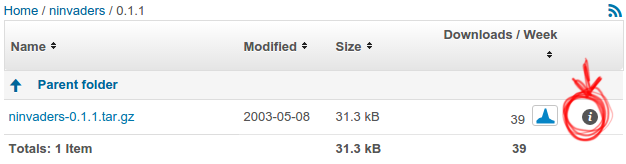

# Lab 03

Objectives:
  - Create a new package for nInvaders
  - Understand how to add dependencies
  - Add patches to nInvaders for Nunchuk support

## Preparation

After doing a Google search, find the *nInvaders* website and download its source code. Analyze its build system, and conclude which Buildroot package infrastructure is the most appropriate to create a package for *nInvaders*.

## Minimal package

Create a directory for the package in the Buildroot sources, `package/ninvaders`. Create a `Config.in` file with one option to enable this package, and a minimal `ninvaders.mk` file that specifies what is needed just to download the package.

For reference, the download URL of the nInvaders tarball is https://sourceforge.net/projects/ninvaders/files/ninvaders/0.1.1/.

Note: to achieve this, only two variables need to be defined in .mk file, plus the call to the appropriate package infrastructure macro.

Now, go to `menuconfig`, enable *nInvaders*, and run `make`. You should see the nInvaders tarball being downloaded and extracted. Look in output/build/ to see if it was properly extracted as expected.

## Make it build!

As you have seen in the previous steps, *nInvaders* uses a simple `Makefile` for its build process.

So you’ll have to define the *build commands* variable to trigger the build of *nInvaders*. To do this, you will have to use four variables provided by Buildroot:

- `TARGET_MAKE_ENV`, which should be passed in the environment when calling `make`.
  
- `MAKE`, which contains the proper name of the **make** tool with potentially some additional parameters to parallelize the build.

- `TARGET_CONFIGURE_OPTS`, which contains the definition of many variables often used by Makefiles: CC, CFLAGS, LDFLAGS, etc.

- `@D`, which contains the path to the directory where the *nInvaders* source code was extracted.
  
When doing Buildroot packages, it is often a good idea to look at how other packages are doing things. Look for example at the jhead package, which is going to be fairly similar to our `ninvaders` package.

Once you have written the *nInvaders* build step, it’s time to test it. However, if you just run make to start the Buildroot build, the ninvaders package will not be rebuilt, because it has already been built.

So, let’s force Buildroot to rebuild the package by removing its source directory completely:

```
make ninvaders-dirclean
```

And then starting the build:

```
make
```

This time, you should see the ninvaders `0.1.1 Building` step actually doing something, but quickly failing with a message saying that the `ncurses.h` file could not be found.

Move on to the next section to see how to solve this problem!

## Handling dependencies

The ncurses.h header file is missing, because *nInvaders* depends on the ncurses library for drawing its interface on a text-based terminal. So we need to add ncurses in the dependencies of nInvaders. To do this, you need to do two things:

- Express the dependency in the package Config.in file. Use a select statement to make sure the ncurses package option is automatically selected when ninvaders is enabled. 

  > Check that the ncurses package does not have itself some dependencies that need to be propagated up to the ninvaders package.

- Express the dependency in the package .mk file.
  
Restart again the build of the package by using make ninvaders-dirclean all (which is the same as doing make ninvaders-dirclean followed by make).

Now the package build fails at link time with messages such as `multiple definition of 'skill_level'; aliens.o:(.bss+0x674): first defined here.`

## Customizing CFLAGS

The **multiple definition** issue is due to the code base of nInvaders being quite old, and having multiple compilation units redefine the same symbols. While this was accepted by older gcc versions, since gcc 10 this is no longer accepted by default.

While we could fix the nInvaders code base, we will take a different route: ask gcc to behave as it did before gcc 10 and accept such redefinitions. This can be done by passing the -fcommon gcc flag.

To achieve this, make sure that CFLAGS is set to $(TARGET_CFLAGS) -fcommon in NINVADERS_BUILD_CMDS.

Restart the build with `make ninvaders-dirclean all`.

Now the package should build properly! If you look in output/build/ninvaders-0.1.1/, you should see a nInvaders binary file. Run the file program with nInvaders as argument to verify that it is indeed built for ARM.

However, while nInvaders has been successfully compiled, it is not installed in our target root filesystem!

## Installing and testing the program

If you study the nInvaders Makefile, you can see that there is no provision for installing the program: there is no install: rule.

So, in ninvaders.mk, you will have to create the target installation commands, and simply manually install the nInvaders binary. Use the $(INSTALL) variable for that. Again, take example on the jhead package to know how to achieve that.

Rebuild once again the ninvaders package. This time, you should see the nInvaders binary in output/target/usr/bin/!

Reflash your root filesystem on the SD card and reboot the system. nInvaders will not work very well over the serial port, so log to your system through ssh, and play nInvaders with the keyboard!

> Note: if you get the error Error opening terminal: xterm-256color. when running nInvaders, issue first the command `export TERM=xterm`

## Support the Nunchuk

Playing with the keyboard is nice, but playing with our Nunchuk would be even nicer! We have written a patch for nInvaders that makes this possible.

This patch is available in the lab data directory, under the name 0001-joystick-support.patch.

Copy this patch to the right location so that it gets applied after nInvaders is extracted by Buildroot, and before it is built. Rebuild once again the ninvaders package. Verify that the patch gets applied at the ninvaders 0.1.1 Patching step.

However, this patch relies on the Linux kernel joystick interface, that we need to enable. Go to the Linux kernel configuration using make linux-menuconfig, and enable CONFIG_INPUT_JOYDEV. Exit, and make sure to save your kernel configuration safely using make linux-updatedefconfig. Restart the overall build by running make.

Then reflash your kernel image and root filesystem on the SD card, reboot, and start nInvaders in a SSH session. You should now be able to control it using the Nunchuk joystick, and fire with the C button.

## Adding a hash file

To finalize the package, add the missing hash file, so that people building this package can be sure they are building the same source code. To know the hash, SourceForge provides this information: go to the nInvaders download page, and next to the file name, there is a small information icon that will provide the MD5 and SHA1 hashes. Add both hashes to the hash file.

<p align="center">

Once the hash file is added, rebuild the package completely by doing:

```
make ninvaders-dirclean all.
```
Look at the build output, and before the ninvaders **0.1.1 Extracting** step, you should see a message like this:

```
ninvaders-0.1.1.tar.gz: OK (sha1: ....)
ninvaders-0.1.1.tar.gz: OK (md5: ....)
```

## Testing package removal

Now, to experiment with Buildroot, do the following test: disable the ninvaders package in menuconfig and restart the build doing make. Once the build is done (which should be very quick), looked in `output/target/`. Is nInvaders still installed? If so, why?

## Sanity checking your package

If you want to verify if your package matches the coding style rules of Buildroot, you can run:

```
make check-package
```

While a successful result doesn’t mean your package is perfect, it at least verifies a number of basic requirements.

<!-- Markdown Reference

## header 1

### header 2

* italic *

**bold**

*** bold & italic ***

~~ strike-through ~~

> quote

` monospace-code `

```
code block
```
named footnote[^footnote01]
[^footnote01]: See https://elinux.org/images/e/ef/USB_Gadget_Configfs_API_0.pdf for more details

Repo link to file
[/labs/lab02/files/S30usbgadget](./files/S30usbgadget).

Image centered and scaled.
<p align="center">

-->
